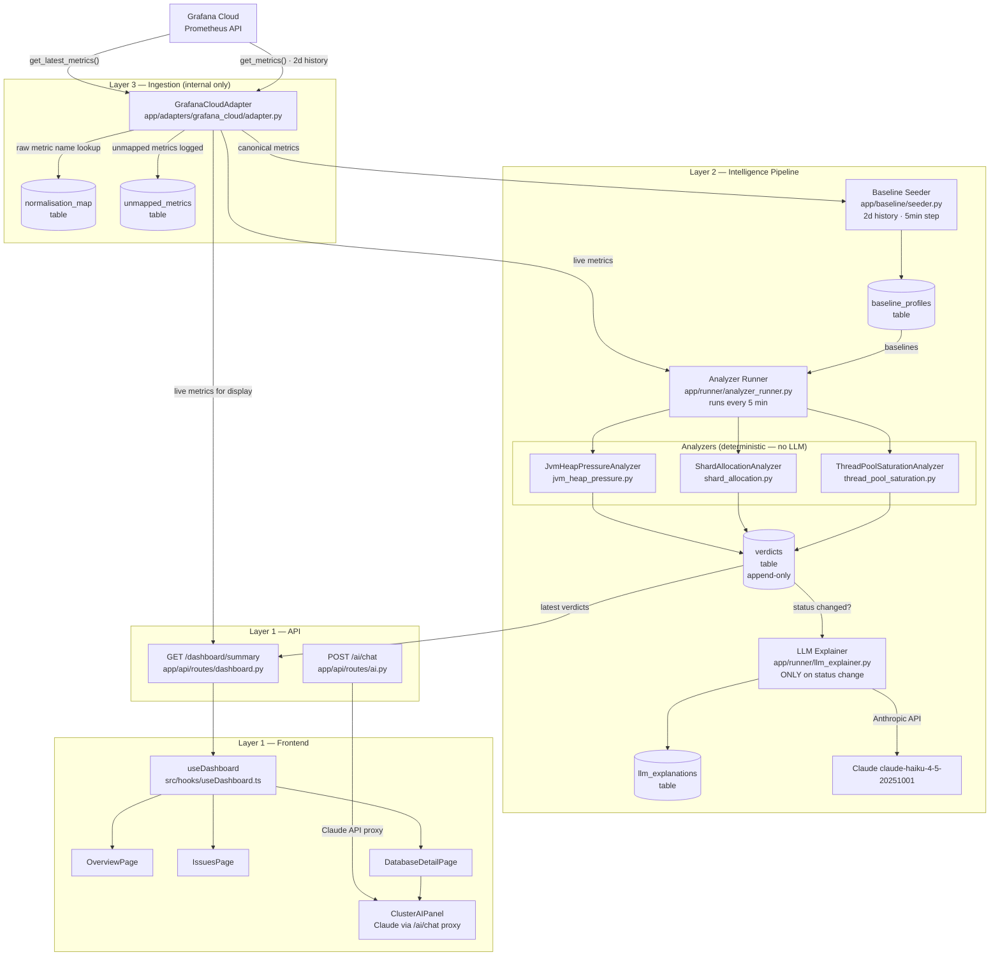

# DB Intelligence Platform — Architecture & Data Flow

## System Overview

```
┌─────────────────────────────────────────────────────────────────────┐
│  FRONTEND (React/Vite → Vercel)                                      │
│                                                                       │
│  OverviewPage   IssuesPage   DatabaseDetailPage                       │
│       │              │              │                                 │
│       └──────────────┴──────────────┘                                │
│                       │                                               │
│              useDashboard() hook                                      │
│                       │                                               │
│              src/lib/api.ts                                           │
│                       │                                               │
└───────────────────────┼───────────────────────────────────────────────┘
                        │  GET /dashboard/summary
                        │  POST /ai/chat
                        ▼
┌─────────────────────────────────────────────────────────────────────┐
│  BACKEND (FastAPI → Docker)                                           │
│                                                                       │
│  /dashboard/summary ──► dashboard.py                                 │
│  /ai/chat           ──► ai.py ──► Anthropic Claude                  │
│                                                                       │
└─────────────────────────────────────────────────────────────────────┘
```

---

## Full Intelligence Pipeline



---

## Cluster Identity

Every cluster is identified by a **composite string key**:

```
lp_segment | datacenter | lp_cluster
    Alpha  |   us-east1 | els_shrdone_alpha_va
```

This composite ID is stored in `clusters.cluster_id` (string, not UUID) and is
used everywhere: adapter queries, baseline lookups, verdict writes.

---

## Metric Flow: Raw → Canonical → Display

```
Grafana Cloud Prometheus
  elasticsearch_jvm_memory_used_bytes{area="heap", lp_cluster="els_shrdone_alpha_va", ...}
        │
        ▼
  normalisation_map lookup
  (source_type=grafana_cloud, db_type=elasticsearch)
        │
        ▼
  canonical name: jvm.heap.used.bytes
        │
        ▼  (derived metric computation)
  jvm.heap.used.bytes / jvm.heap.max.bytes × 100
        │
        ▼
  canonical name: jvm.heap.used.percent = 47.9%
        │
        ├──► Baseline engine (historical percentiles p50/p75/p95/p99)
        ├──► Analyzer (sigma score vs baseline → verdict)
        └──► Dashboard API (live display value)
```

---

## Analyzer Verdict Logic

```
For each analyzer:

  1. Fetch live canonical metrics from Grafana
  2. Load baseline profile (p50, std_dev) from DB
  3. Compute sigma score:
       sigma = (current_value - p50) / std_dev
       Special case: if std_dev == 0 and value > 0 → extreme anomaly
  4. Classify:
       sigma > 3.0  → critical
       sigma > 1.5  → degraded
       else         → healthy
  5. Write verdict to DB (append-only, never UPDATE)
  6. If status changed from previous verdict → call LLM explainer

Cluster overall status = worst status across all analyzers
```

---

## Health Score Mapping

The backend uses a simple status→score map (source of truth):

| Backend status | Frontend healthStatus | Health score |
|---|---|---|
| healthy  | good     | 85 |
| degraded | warning  | 45 |
| critical | critical | 10 |
| unknown  | unknown  | 50 |

The frontend **does not** recalculate health scores from raw metrics for live clusters.
The client-side scoring engine (`health-scoring.ts`) is only used for mock data.

---

## Key Constraints (from CLAUDE.md)

| Rule | Why |
|---|---|
| No LLM in analyzers | LLM diagnoses wrong; only deterministic logic finds truth |
| LLM on status change only | Expensive; noise if called every poll |
| Append-only verdicts | Audit trail; never UPDATE verdicts table |
| No raw metrics storage | Only baselines and verdicts persisted |
| Stack never exposed to API | Internal concept; customer sees clusters only |
| Tenant isolation on every query | Multi-tenancy safety |

---

## Deployment

```
Production:
  Frontend  → Vercel (static Vite build)
              VITE_API_URL=https://your-backend.example.com

  Backend   → Docker (FastAPI + PostgreSQL)
              docker-compose up

Local dev:
  docker-compose up          # starts postgres + backend + frontend
  # or separately:
  cd backend && uvicorn app.main:app --port 8000 --reload
  npm run dev
```

---

## Files Added This Session

```
backend/
  app/adapters/grafana_cloud/
    adapter.py          — Prometheus pull adapter (normalisation, derived metrics, custom PromQL)
    base.py             — Abstract base classes
    exceptions.py       — Typed adapter errors
  app/analyzers/elasticsearch/
    jvm_heap_pressure.py      — JVM heap exhaustion analyzer
    shard_allocation.py       — Unassigned shard analyzer
    thread_pool_saturation.py — Write thread pool saturation analyzer
  app/baseline/
    seeder.py           — 2-day history seeder (run once per cluster)
    engine.py           — Percentile computation + upsert
  app/runner/
    analyzer_runner.py  — Orchestrates adapter → analyzers → verdict write
    llm_explainer.py    — Calls Anthropic on status change, stores explanation
  app/api/routes/
    dashboard.py        — GET /dashboard/summary (clusters + issues for frontend)
    ai.py               — POST /ai/chat (Anthropic proxy, key kept server-side)
  migrations/versions/
    16320476fb3d_...    — tenants, stacks, normalisation_map, unmapped_metrics, onboarding_sessions
    706c4de84963_...    — baseline_profiles.cluster_id changed to string

src/
  lib/api.ts                  — Typed API client
  hooks/useDashboard.ts       — Live data hook with mock fallback
  pages/OverviewPage.tsx       — Rebuilt with live data
  pages/IssuesPage.tsx        — Rebuilt with live data
  pages/DatabaseDetailPage.tsx — Live data, no client-side rescoring
  components/features/database-detail/ClusterAIPanel.tsx  — Claude chat scoped to cluster
  components/features/summarization/ChatInterface.tsx     — Markdown rendering
  services/llm-service.ts     — Anthropic via backend proxy
  services/summarization-service.ts — Live data context instead of mock
```
